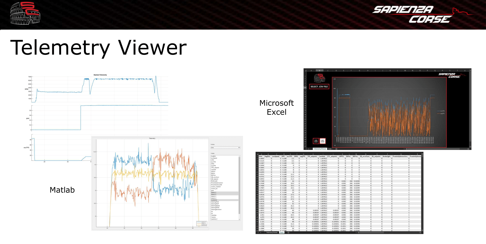

# Telemetry Viewer

Telemetry opening and analysis software developed specifically for the Sapienza Corse Formula Student team during the 2020-2021 season.

For the tests on track it was needed to log all the available data in different telemetries, due to the large amount of data from all the sensors the actuators and the outputs of the algorithms.

All the files are in <em><b>.csv</b> </em> format for an easy analysis.

In particular telemetry files must have the first row as headers and labels, and must have the following structure:

| Time | Variable 1 | Variable 2 |
|:-------|:------------|:-------------:|
| 0.5 | 1.543 | 203.78 |
| 1 | 2.444 | 198.23 |
| 1.5 | 2.132 | 201.12 |
 
 
As telemetry analysis mainly Excel has been used with ad hoc visual basic functions for a fast usage and a quick plot of the data during our tests on track.

Then a standalone application on matlab created with the appropriate tool, starting from the file contained in the repo, for a more detailed analysis and the possibility of working directly on the plotted data.

The version of MATLAB used was the R2021b.

## Matlab instructions

* Once the program is started, a file selection screen will open, from which you will be able to choose one or more files of type .csv
* Wait for the plots to open (one for each chosen .csv file), the commands for the plots are the same as in MATLAB. If more than one variable is chosen to be showed, an additional window will open containing the stacked plots.

## Excel instructions

In the TelemetryViewer sheet:

1. Select .csv file
2. Select the .csv file from the window that opens
3. In the new dialog box, select in sequence:
* "Line" in "Chart Type"
* Check "first row as headers"
* Select an item in column and click on "X"
* Select one or more items in column and click on "Y"
* "Ok" if everything is correct or click "Reset" (it is also possible to select all the variables and then operate on the filter directly on the graph).

4. To start over with a new file or graphic go back to step 1
5. The dark mode and light mode keys change the background colors of the graph

The Data sheet contains the table containing all the data of the csv file from which the chart in the previous sheet is generated

https://user-images.githubusercontent.com/61707543/175615695-4288daec-ddd1-46df-8cc6-329e3adaf9fb.mp4
